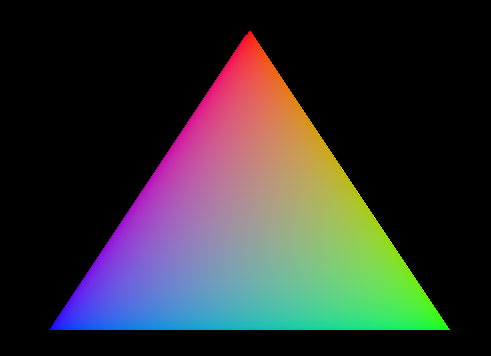

---
# try also 'default' to start simple
theme: default
title: Vulkan Triangle Speedrun (any%)
# apply UnoCSS classes to the current slide
class: text-center
transition: fade
# enable Comark Syntax: https://comark.dev/syntax/markdown
comark: true
# duration of the presentation
duration: 5min
fonts:
  sans: Roboto
  serif: Roboto Slab
  mono: Hack Nerd Font
---

<style>
h1 {
  color: red !important;
  font-size: 6rem !important;
}
</style>
# Vulkan Triangle Speedrun
## (any% category)

---

# Define "Triangle"

```glsl
static float2 positions[3] = float2[](
    float2( 0.0, -0.5),
    float2( 0.5,  0.5),
    float2(-0.5,  0.5)
);

static float3 colors[3] = float3[](
    float3(1.0, 0.0, 0.0),
    float3(0.0, 1.0, 0.0),
    float3(0.0, 0.0, 1.0)
);
```

---

# Vertex Shader

```glsl
struct VertexOutput {
    float3 color;
    float4 sv_position : SV_Position;
};

[shader("vertex")]
VertexOutput vertMain(uint vid : SV_VertexID) {
    VertexOutput output;
    output.sv_position = float4(positions[vid], 0.0, 1.0);
    output.color = colors[vid];
    return output;
}
```

---

# Fragment Shader
```glsl
[shader("fragment")]
float4 fragMain(VertexOutput inVert) : SV_Target
{
    float3 color = inVert.color;
    return float4(color, 1.0);
}
```

---

# GLFW

````md magic-move
```cpp
#include <bits/stdc++.h>
#define VK_USE_PLATFORM_WAYLAND_KHR
#include <GLFW/glfw3.h>

int main() {
    return 0;
}
```
```cpp
#include <bits/stdc++.h>
#define VK_USE_PLATFORM_WAYLAND_KHR
#include <GLFW/glfw3.h>

int main() {

    glfwInit();
    glfwWindowHint(GLFW_CLIENT_API, 0);

    return 0;
}
```
```cpp
#include <bits/stdc++.h>
#define VK_USE_PLATFORM_WAYLAND_KHR
#include <GLFW/glfw3.h>

int main() {

    glfwInit();
    glfwWindowHint(GLFW_CLIENT_API, 0);

    uint count = 0;
    auto ext = glfwGetRequiredInstanceExtensions(&count);

    return 0;
}
```
````

---

# vk::Instance

```cpp {4|6-7|9-14}
uint count = 0;
auto ext = glfwGetRequiredInstanceExtensions(&count);

raii::Context context;

ApplicationInfo app {.apiVersion = ApiVersion14 };
app.apiVersion = ApiVersion14;

auto instance =
    raii::Instance(context, {
      .pApplicationInfo = &app,
      .enabledExtensionCount = count,
      .ppEnabledExtensionNames = ext
    });
```

---

# vk::VkSurfaceKHR

```cpp {1|3|5-10|7|9|all}
VkSurfaceKHR surface;

auto window = glfwCreateWindow(800, 600, "", nullptr, nullptr);

glfwCreateWindowSurface(
    *instance,
    window,
    nullptr,
    &surface
);
```

---

# vk::PhysicalDevice

````md magic-move
```cpp
auto devices = instance.enumeratePhysicalDevices();
```
```cpp
auto devices = instance.enumeratePhysicalDevices();

auto physicalDevice = devices[0]; // lol
```
````

---

# vk::Device

````md magic-move
```cpp
DeviceCreateInfo devInfo;

auto dev = raii::Device(physicalDevice, devInfo);
```
```cpp
DeviceCreateInfo devInfo;
devInfo.setPEnabledExtensionNames(KHRSwapchainExtensionName);

auto dev = raii::Device(physicalDevice, devInfo);
```
```cpp
float qp = 0;
DeviceQueueCreateInfo qInfo;
qInfo.setQueuePriorities(qp);

DeviceCreateInfo devInfo;
devInfo.setPEnabledExtensionNames(KHRSwapchainExtensionName);

devInfo.setQueueCreateInfos(qInfo);

auto dev = raii::Device(physicalDevice, devInfo);
```
````
---

# vk::Queue

```cpp
auto queue = raii::Queue(dev, 0, 0);
```

---

# vk::Swapchain

````md magic-move
```cpp
auto swapchain = raii::SwapchainKHR(dev, info);
```
```cpp {1-8|4-5}
SwapchainCreateInfoKHR info{
    .surface = surface,
    .minImageCount = 3,
    .imageFormat = fmt.format,
    .imageExtent = e,
    .imageArrayLayers = 1,
    .imageUsage = ImageUsageFlagBits::eColorAttachment
};

auto swapchain = raii::SwapchainKHR(dev, info);
```
```cpp {1-2}
SurfaceFormatKHR fmt{.format = (Format)50};
Extent2D e(800, 600);

SwapchainCreateInfoKHR info{
    .surface = surface,
    .minImageCount = 3,
    .imageFormat = fmt.format,
    .imageExtent = e,
    .imageArrayLayers = 1,
    .imageUsage = ImageUsageFlagBits::eColorAttachment
};

auto swapchain = raii::SwapchainKHR(dev, info);
```
````

---

# vk::ImageView

````md magic-move
```cpp
auto images = swapchain.getImages();
```
```cpp
auto images = swapchain.getImages();

vector<raii::ImageView> views;

for (auto &image : images) {
    ImageViewCreateInfo iv{
        .image = image,
        .format = fmt.format,
        .subresourceRange = {
            ImageAspectFlagBits::eColor,
            0, 1, 0, 1,
        }
    };
    views.emplace_back(dev, iv);
}
```
````

---

# Pipeline: Load Shaders

```cpp{1|7}
auto file = ifstream("shaders/slang.spv", ios::binary);
vector<char> code(istreambuf_iterator<char>(file), {});

ShaderModuleCreateInfo createInfo{.codeSize = code.size(),
                                  .pCode = (uint *)(code.data())};

raii::ShaderModule shaderModule{dev, createInfo};
```

---

# Pipeline: Shader Stages

```cpp
PipelineShaderStageCreateInfo stages[] = {
    {.stage = ShaderStageFlagBits::eVertex,
     .module = shaderModule,
     .pName = "vertMain"},
    {.stage = ShaderStageFlagBits::eFragment,
     .module = shaderModule,
     .pName = "fragMain"}};
```

---

# Pipeline: States

```cpp
vector<DynamicState> states =
  {DynamicState::eViewport, DynamicState::eScissor};

PipelineDynamicStateCreateInfo ds;
ds.setDynamicStates(states);

Viewport viewport(0, 0, 800, 600);
Rect2D scissor{Offset2D{0, 0}, e};

PipelineViewportStateCreateInfo vp;
vp.setViewports(viewport);
vp.setScissors(scissor);
```

---

# Pipeline: Color Blending

```cpp
PipelineColorBlendAttachmentState cba{
    .colorWriteMask = ColorComponentFlagBits(15)};

PipelineColorBlendStateCreateInfo blend;
blend.setAttachments({cba});

PipelineRasterizationStateCreateInfo rs;
PipelineMultisampleStateCreateInfo ms;
```

---

# Pipeline: Layout

```cpp
auto pipelineLayout = raii::PipelineLayout(dev, {});

PipelineRenderingCreateInfo pri;
pri.setColorAttachmentFormats(fmt.format);
```

---

# Graphics Pipeline

```cpp
auto graphicsPipeline =
  raii::Pipeline(dev, nullptr, {
    .pNext = &pri,
    .stageCount = 2,
    .pStages = stages,
    .pInputAssemblyState = &input,
    .pViewportState = &vp,
    .pRasterizationState = &rs,
    .pMultisampleState = &ms,
    .pColorBlendState = &blend,
    .pDynamicState = &ds,
    .layout = pipelineLayout});
```

---

# Command Buffer
````md magic-move
```cpp
auto commandBuffer = std::move(
    raii::CommandBuffers(dev, {
        .commandPool = commandPool,
        .commandBufferCount = 1,
      }).front());
```
```cpp
auto commandPool = raii::CommandPool(dev,
    {.flags = CommandPoolCreateFlagBits::eResetCommandBuffer});

auto commandBuffer = std::move(
    raii::CommandBuffers(dev, {
        .commandPool = commandPool,
        .commandBufferCount = 1,
      }).front());
```
````

---

# Render: Acquire Image

```cpp
auto [result, idx] =
    swapchain.acquireNextImage(UINT64_MAX, nullptr, nullptr);
```

---

# Render: Rendering Info

```cpp {1|2|3}
RenderingAttachmentInfo attachmentInfo{.imageView = views[idx]};
RenderingInfo renderingInfo = {.renderArea = {.extent = e}};
renderingInfo.setColorAttachments(attachmentInfo);
```

---

# Render: Command Buffer

```cpp {1|2|3-4|5|6|7|8|9}
cbuf.begin({});
cbuf.beginRendering(renderingInfo);
cbuf.bindPipeline(PipelineBindPoint::eGraphics,
                  *graphicsPipeline);
cbuf.setViewport(0, viewport);
cbuf.setScissor(0, scissor);
cbuf.draw(3, 1, 0, 0);
cbuf.endRendering();
cbuf.end();
```

---

# Render: Submit

```cpp {1|3-5}
queue.submit(s.setCommandBuffers(*cbuf), nullptr);

result = queue.presentKHR({.swapchainCount = 1,
                           .pSwapchains = &*swapchain,
                           .pImageIndices = &idx});
```

---

# Triangle!


